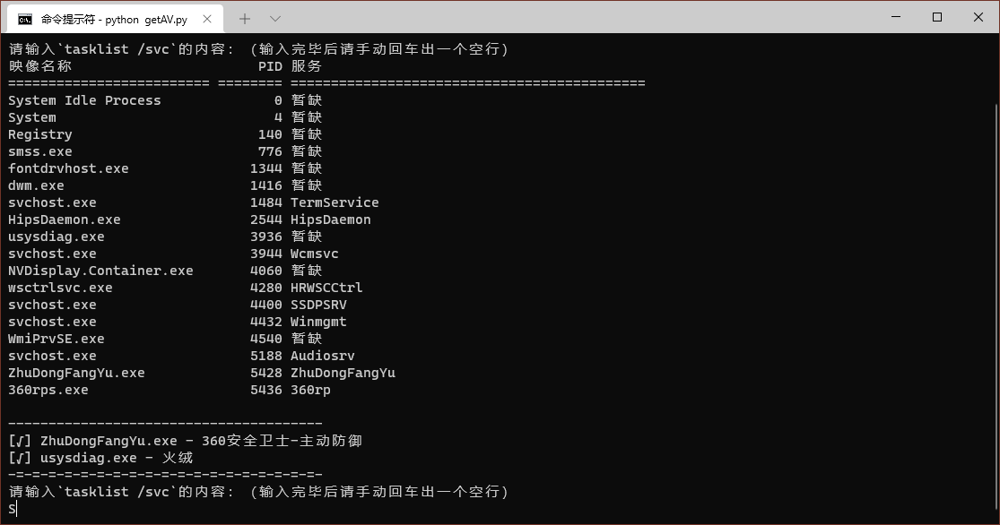

# get_AV for Python



# Windows杀软在线对比辅助

由[r00tSe7en](https://github.com/r00tSe7en)大佬的程序改变而来

## 使用方法

```commandline
python getAV.py
...
```
然后将`tasklist /svc`输出的内容粘贴至脚本中
输入之后两次回车即可（大部分情况）

## 其他

杀软进程数据存放在av.json

目前正在收集杀软进程中，欢迎前往[源repo](https://github.com/r00tSe7en/get_AV/)提交补充

